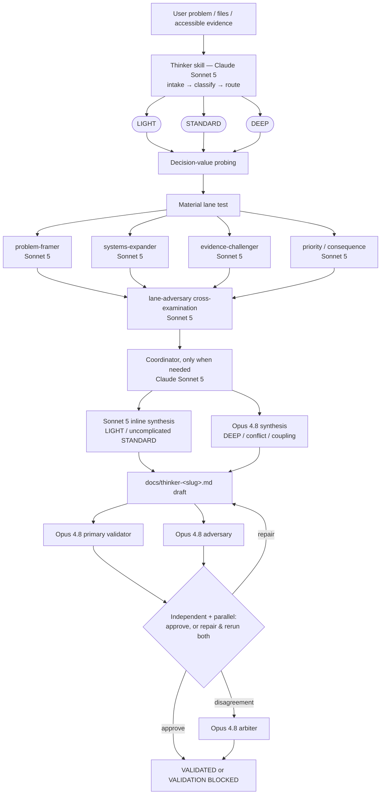
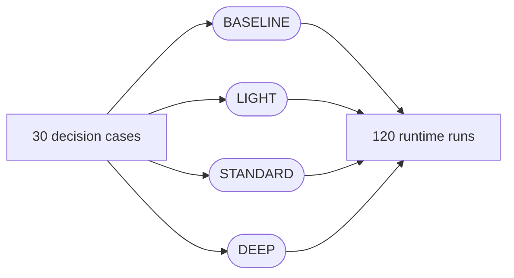

# Thinker v2 Architecture

## Design objective

Thinker v2 is optimized for **proportionate decision quality**. The architecture is deliberately asymmetric: LIGHT cases stay compact; ambiguous STANDARD cases use selected independent methods; DEEP cases earn expensive synthesis and validation because the downside of a wrong answer is larger.

The governing principle is:

> Use the smallest set of reasoning steps, user questions, and independent analytical lanes that can still catch a decision-relevant failure.

## Runtime flow

> The final gate prefers `claude-opus-4-8` and falls back within the Opus tier (`4.7` → `4.6` → `4.5`); in DEEP (and high-consequence STANDARD) a different-family `crossmodel-adversary` runs alongside the Opus reviewers. See the model-allocation table below and `references/model-map.md`.

## Mode matrix

| Dimension | LIGHT | STANDARD | DEEP |
|---|---|---|---|
| Decision profile | Low downside, narrow, reversible | Moderate ambiguity/impact, multiple options or uncertain evidence | High downside, hard-to-reverse, regulated/high-stakes, systemic or severely conflicted |
| Question budget | 0-3 | 0-5 grouped | 0-5 initial + one focused high-stakes follow-up |
| Lane budget | 0-1 | 2-3 | 3-5 |
| Coordinator | Normally no | Only for complexity/conflict | Recommended for multi-domain/context-heavy work |
| Synthesis | Sonnet 5 inline | Sonnet 5 unless conflict/coupling remains | Opus 4.8 xhigh |
| Final gate | Dual Opus 4.8 | Dual Opus 4.8 (+ cross-model reviewer if high-consequence) | Dual Opus 4.8 + cross-model Fable 5 reviewer + arbiter on persistent disagreement |

The selected mode is not a target for agent count. A lane budget is a ceiling-shaped default, not a quota.

## Adaptive lane selection

The fixed five-agent swarm was removed. Each lane must pass both parts of the **material lane test**:

1. Is the lane's core analytical question unresolved?
2. Could a plausible answer materially change diagnosis, option ranking, risk, or next action?

Only a `yes` to both permits spawning the lane.

| Lane | Core failure it detects |
|---|---|
| `problem-framer` | Anchoring, solution language, symptom-versus-cause mistakes, weak causal frame |
| `systems-expander` | Boundary errors, local optimization, interfaces, incentives, feedback effects |
| `evidence-challenger` | Weak provenance, changed metric definitions, causal overclaim, contradictions |
| `priority-analyst` | Laundry-list analysis, failure to identify the critical few, sensitivity blindness |
| `consequence-analyst` | Second-order harm, perverse incentives, transition risk, weak rollback/monitoring |
| `completeness-critic` | Scope gaps — an unmodeled dimension, absent option/stakeholder, unasked decision-critical question, or wrong-scope framing (mandatory in DEEP) |

Each decision-critical lane finding is then cross-examined by an independent `lane-adversary` before synthesis, so verification is not deferred entirely to the final gate. The report records both selected and skipped lanes. Disagreement is never settled by votes or averaging; it must be resolved through evidence, a discriminating test, or an explicit scenario split.

## Six operational gates

| Operational gate | Source-framework mapping | Work performed |
|---|---|---|
| Baseline | Level 1 — Unreflective thinker | Capture the obvious first answer as a hypothesis |
| Challenge | Level 2 — Challenged thinker | Surface assumptions, blind spots, contradictions, and framing defects |
| Structure | Level 3 — Beginning thinker | Build a neutral problem statement, success criteria, hypotheses, and evidence plan |
| Test | Level 4 — Practicing thinker | Verify data, seek disconfirmation, test hypotheses, revise |
| Integrate | Level 5 — Advanced thinker | Combine system context, critical priorities, options, trade-offs, and consequences |
| Decide & Learn | Level 6 — Master thinker | Make a calibrated decision with reversibility, monitoring, and learning triggers |

The source labels are retained for traceability. In runtime language, the gates describe work on the problem rather than ranking a person.

## Five-pitfall repair layer

The skill explicitly detects and repairs:

1. Jumping to an answer too quickly.
2. Being unwilling to expand the problem.
3. Focusing on the unimportant.
4. Accepting results at face value.
5. Not thinking through consequences.

Each pitfall is recorded as `not detected`, `detected and repaired`, or `unresolved`. A decision-critical unresolved pitfall blocks final approval.

## Model allocation

| Component | Model | Why |
|---|---|---|
| Routing, intake, probing | `claude-sonnet-5` | Fast high-quality working layer |
| Six specialist lanes (incl. `completeness-critic`) | `claude-sonnet-5` | Independent focused analysis without dropping below the model floor |
| Per-lane cross-examiner (`lane-adversary`) | `claude-sonnet-5` | Cheap independent refutation of decision-critical lane findings before synthesis |
| Coordinator | `claude-sonnet-5` | Compact lane selection and disagreement consolidation |
| Complex synthesis | `claude-opus-4-8`, xhigh | Coupled trade-offs and conflict resolution |
| Dual final validation | `claude-opus-4-8`, xhigh | Independent certification and adversarial review |
| Cross-model adversary (DEEP) | `claude-fable-5` → `claude-sonnet-5` fallback, xhigh | Different-family decorrelation so same-family blind spots do not pass; Sonnet 5 fallback is still a different family than Opus 4.8 |
| Arbiter | `claude-opus-4-8`, max | Material reviewer disagreement |
| Benchmark judge | `claude-opus-4-8`, xhigh | Blind quality scoring against a common rubric |

Full model IDs are pinned for auditable package behavior. Unknown fallbacks, `inherit`, and models below Sonnet are excluded from configured roles. `claude-fable-5` is permitted **only** as the preferred cross-model decorrelation reviewer, and it falls back to `claude-sonnet-5` when unavailable — either way a different family than the Opus 4.8 certifier. The final panel is deliberately model-diverse, not merely prompt-diverse, because two reviewers on one model family share failure modes; Sonnet 5's always-on availability means the diverse gate is effectively always achievable.

## Anti-overengineering control

Before adding an agent, question, or section, Thinker asks:

> What decision-relevant failure could this step detect that the current analysis has not already covered?

When the answer is unclear, the step is omitted. Final validators can reject a report for excessive user burden or unnecessary analytical ceremony as well as under-analysis.

## Behavioral benchmark architecture

The suite contains 30 decision cases spanning low-risk reversible choices, under-specified decisions, anchoring traps, metric conflicts, causal ambiguity, local optimization, safety/security urgency, regulated outsourcing, financial downside, and large build-versus-buy decisions.

Each case runs under four variants:

A blind Opus judge scores ten 0-4 quality metrics. Telemetry separately records tokens, latency, model calls, user questions, and lane count. Recommendation signatures are compared to detect whether deeper analysis changes the answer for a defensible reason or merely creates analytical instability.

The benchmark harness prepares and summarizes results; it does not call model APIs.
